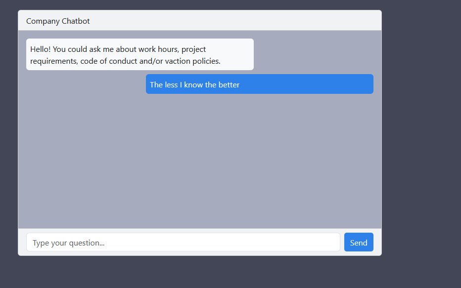

# Company Handbook Q&A UI

## Objective

Build a simple React-based user interface that allows users to interact with our Retrieval-Augmented Generation (RAG) workflow backend, powered by a Flask microservice. The UI will enable users to query company project documentation and receive accurate, context-aware answers.

## Getting Started 

1. UI consist of a Chat-like envrionemnt 
2. Suggestive Topics FAQ 
3. Responds with our answer 

## Development 

**09/02**

Starting with with react:

`npx create-react-app project_name`

**Focused on Simple UI**
- We don't need **routers** or **redux** its a simple Bootstrap React UI with a **Form**

**Bootstrap React**

`npm install react-bootstrap bootstrap`

Color Space:
- #2f81ea
- #424656
- #a6abbd
- #e04c6f

 

 **We need to connect to Flask Microservice**
 - Instead of setting a Column to Bot and another to User messages:
   - We now create a Row and use `className='offset-4'` to push our div to the end 
 - Upon submit you should set Send button to loading + add loading for bot message